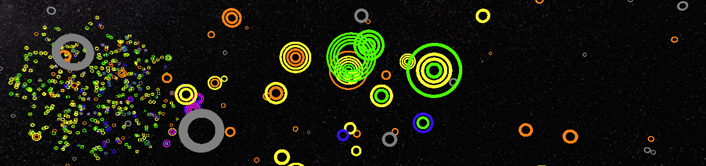

# Kavli_WebGL_exoplanets 

### A WebGL version of our Uniview exoplanets module for the Adler's Kavli Fulldome Lecture by Dr. Lisa Kaltenegger on November 3 & 4, 2017

As part of the <a href="http://kavlilectures.adlerplanetarium.org/" target="_blank">Adler Planetarium's Kavli Fulldome Lecture Series</a>, we developed an online interactive viewer for exoplanets.  This particular interactive accompanied Dr. Lisa Kaltenegger's lecture: *Are We Alone in the Universe?*. In this interactive, you can explore real data from the Open Exoplanet Catalogue, and fly around the Galaxy to learn about when and how these exoplanets were discovered and view their architectures.

A live version of this repo is available <a target="_blank" href="https://ageller.github.io/Kavli_WebGL_exoplanets/"> here. </a> 

See also more information about the Adler Planetarium's Kavli Lecture series <a target="_blank" href="http://www.adlerplanetarium.org/kavli-fulldome-lecture-series/">here. </a>  The Adler's online version of this repo is linked at the bottom of that page under "Explore On Your Own", and also directly from <a target="_blank" href="https://kavlilectures.adlerplanetarium.org/wp-content/uploads/Adler_Kavli_Lectures/2017Nov_Exoplanets/">here.</a>

*Created by Aaron M. Geller and Mark SubbaRao, using the three.js library.*
